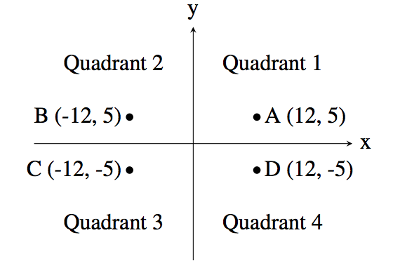

# J1: Quadrant Selection

## Problem Description
A common problem in mathematics is to determine which quadrant a given point lies in. There are
four quadrants, numbered from 1 to 4, as shown in the diagram below:

For example, the point A, which is at coordinates (12, 5) lies in quadrant 1 since both its x and y
values are positive, and point B lies in quadrant 2 since its x value is negative and its y value is
positive.

Your job is to take a point and determine the quadrant it is in. You can assume that neither of the
two coordinates will be 0.

## Input Specification
The first line of input contains the integer x (−1000 ≤ x ≤ 1000; x 6= 0). The second line of input
contains the integer y (−1000 ≤ y ≤ 1000; y 6= 0).

## Output Specification
Output the quadrant number (1, 2, 3 or 4) for the point (x, y).

#### [Solution](./main.py)
#### [Problem PDF](https://cemc.uwaterloo.ca/contests/computing/2018/stage%201/juniorEF.pdf)